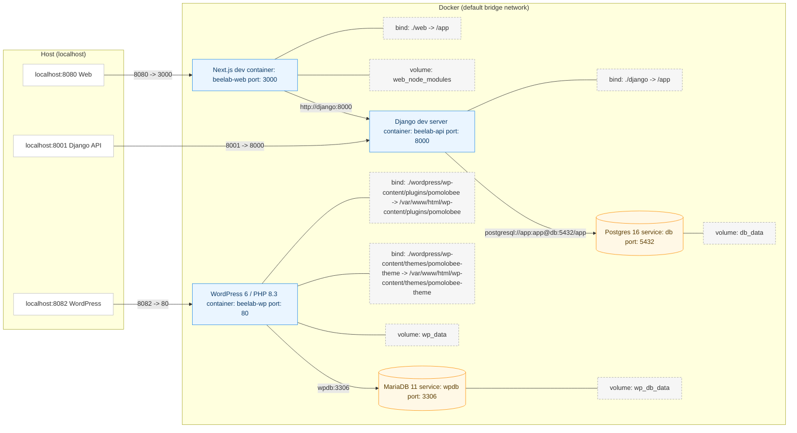

# BeeLab: Dockerized Multiservice (Django + Next.js + Postgres + WordPress + MariaDB)

BeeLab provides a dockerized multi-service development stack:

* **Django 5** backend (REST API, JWT auth; apps: **UserCore**, **PomoloBeeCore**, **CompetenceCore**)
* **Next.js 14** frontend (calls Django)
* **PostgreSQL 16** for Django
* **WordPress 6 / PHP 8.3 (Apache)** with custom theme and plugins that interface with Django
* **MariaDB 11** for WordPress

Notes:

* “Competence” manages student development charts.
* “PomoloBee” helps farmers manage their orchards.



## Quickstart (dev)

```bash
# 1) Clone and prepare
git clone git@github.com:nathabee/beelab.git
cd beelab
cp .env.example .env
mkdir -p django/{media,staticfiles}

# 2) Run the installer (full rebuild)
chmod +x scripts/total-reset.sh
./scripts/total-reset.sh
```

When prompted: confirm the reset and create the Django superuser.
Then open WordPress at `http://localhost:8082` and finish the initial setup.

Service URLs:

* Django API: `http://localhost:8001`  (health: `/health`)
* Web (Next.js): `http://localhost:8080`
* WordPress: `http://localhost:8082`


## Getting Started (detailled explanation)

### 0) Prerequisites

* Docker 24+ and Docker Compose v2


### 1) Clone the repo

```bash
git clone git@github.com:nathabee/beelab.git
cd beelab
mkdir -p ./django/media ./django/staticfiles
```

### 2) Configure

#### 2.1 Create `.env` at the project root

Use the provided example and adjust if needed:

```bash
cp .env.example .env
```

Tip: generate a strong Django key:

```bash
openssl rand -base64 48 | tr -d '\n'
# paste as SECRET_KEY=...
```


#### 2.2 Wordpress Logo (optional)

Put your logo at:

```
wordpress/wp-content/themes/pomolobee-theme/assets/images/logo.(png|svg)
```


#### 2.3 Skipping services or features (optional)

If you don’t want certain parts:

* Remove or reprofile the service in `compose.yaml` (e.g. move to a different profile).
* Remove unwanted WordPress plugins from `wordpress/wp-content/plugins` (e.g. `pomolobee`, `competence`).
* Remove unwanted Django apps (e.g. `PomoloBeeCore`, `CompetenceCore`) from `django/config/settings.py` `INSTALLED_APPS`.

If you do this, also adapt `compose.yaml` and any scripts that reference those components (e.g. `scripts/total-reset.sh`, fixtures, seed commands).

### 3) Run the installation script

```bash
chmod +x scripts/total-reset.sh
./scripts/total-reset.sh
```

This interactive script **fully rebuilds** the dev stack. It:

* Removes existing containers/images/volumes related to BeeLab.
* Builds images and starts all containers.
* Runs Django migrations and loads fixtures.
* Prepares three Django apps:

  * **UserCore** (user management)
  * **PomoloBeeCore** (orchard management)
  * **CompetenceCore** (student evaluation)
* Mounts host directories (code, static, media) for development.
* Prepares WordPress (theme and plugins are mounted; plugins are not auto-activated).
* Performs health checks.

You will be prompted to:

* Confirm destructive operations.
* Create a Django superuser.
* Complete the initial WordPress setup (superuser).

#### Services after install

* **Django API**: [http://localhost:8001](http://localhost:8001)  (health: `/health`, example: `/api/user/hello`)
* **Next.js frontend**: [http://localhost:8080](http://localhost:8080)
* **WordPress**: [http://localhost:8082](http://localhost:8082)

## What the script does (expanded)

### 3.1 Remove old BeeLab Docker environment

You’ll be asked to confirm. This can delete volumes (data loss).

### 3.2 Seed web dependencies (first run)

```bash
docker compose --profile dev run --rm web npm ci
```

Django/WordPress dependencies are handled by their images.

### 3.3 Build and start everything

```bash
docker compose --profile dev up -d --build
```

Starts: Postgres, Django (dev server), Next.js (dev server), MariaDB (wpdb), and WordPress (after `wpdb` is healthy).

### 3.4 Sanity checks

```bash
docker compose ps
curl -s http://localhost:8001/health
```

### 3.5 Complete WordPress installer (first run)

Open [http://localhost:8082](http://localhost:8082) and create the initial admin user.

### 3.6 Initialize Django data (first DB install)

Use fixtures/commands to seed required data: 
- createsuperuser
- execute some commands from  management/commands
- loaddata PomoloBeeCore/fixtures/initial_*.json
- load data into CompetenceCore using  management/commands
- seed image data from CompetenceCore/script_db/competence to upload (for wordpress)
- seed image data from PomoloBeeCore/script_db/pomolobee to media (for django)  

  
### 3.7 Apply WordPress site options with wp-cli
 

```bash
wordpress/scripts/wp-init.sh
```
This script sets permissions, activates the theme, updates permalinks, applies logo, etc.

## health check

* Django admin : [http://localhost:8001/admin](http://localhost:8001/admin) 
* Wordpress admin:  [http://localhost:8082/wp-admin](http://localhost:8082/wp-admin) 
* Wordpress: Log into [http://localhost:8082](http://localhost:8082) and verify the site loads.


* Run:
```bash
./scripts/health-check.sh
```

## Exporting Site Editor changes back into the theme

If you customize **Appearance → Editor**:

* Use **… → Tools → Export** to download the ZIP.
* Copy `theme.json`, `templates/`, `parts/` into:

```
wordpress/wp-content/themes/pomolobee-theme/
```

* Commit to Git.

## Useful commands

### Total dev reset (dangerous)

Deletes containers, images, volumes, then reinstalls:

```bash
./scripts/total-reset.sh
```

If WordPress files become owned by `www-data`, restore your user access:

```bash
sudo setfacl -R -m u:"$USER":rwx wordpress
sudo setfacl -R -d -m u:"$USER":rwx wordpress
```

### Logs / status

```bash
docker compose --profile dev ps -a
docker compose --profile dev logs -f django
docker compose --profile dev logs -f web
docker compose --profile dev logs -f wpdb
docker compose --profile dev logs -f wordpress
```

### Stop everything

```bash
docker compose --profile dev down
```

### Clean Django DB only (danger)

```bash
docker compose --profile dev down
docker volume rm beelab_db_data
docker compose --profile dev up -d
```

### Clean WordPress only (danger)

```bash
docker compose --profile dev stop wordpress wpdb
docker compose --profile dev rm -f wordpress wpdb
docker volume rm beelab_wp_db_data beelab_wp_data
docker compose --profile dev up -d wpdb wordpress
```

### Back up databases (Django and WordPress)

From the project root:

```bash
bash scripts/backup.sh
```

## WordPress plugins

### pomolobee

From `wordpress/plugin-src/pomolobee/`:

```bash
npm install
npm run build
```

Installation:

```bash
./build_zip.sh
./install_plugin.sh
```

Then in WP Admin ([http://localhost:8082](http://localhost:8082)):

* Go to **Plugins**, verify the plugin is present, and activate it.
* Go to **Settings → Competence Settings** to configure the API endpoint.
  In this dev stack, Django is at `http://localhost:8001/api`.

## Project structure

```text
beelab/
├─ compose.yaml
├─ .env
├─ django/                      # Django project (config + apps)
│  ├─ manage.py
│  ├─ config/
│  ├─ PomoloBeeCore/            # Orchard app
│  ├─ CompetenceCore/           # Student evaluation app
│  └─ UserCore/                 # Auth / user management
├─ web/                         # Next.js app (dev server)
│  ├─ app/
│  └─ package.json
├─ wordpress/
│  └─ wp-content/
│     ├─ themes/
│     │  └─ pomolobee-theme/    # theme.json, templates, assets, scripts
│     └─ plugins/
│        ├─ pomolobee/          # integrates Django PomoloBeeCore
│        └─ competence/         # integrates Django CompetenceCore
└─ (volumes managed by Docker)
   • db_data        (Postgres)
   • web_node_modules
   • wp_db_data     (MariaDB)
   • wp_data        (WordPress files)
   • media_data     (Django media)
```


---
 