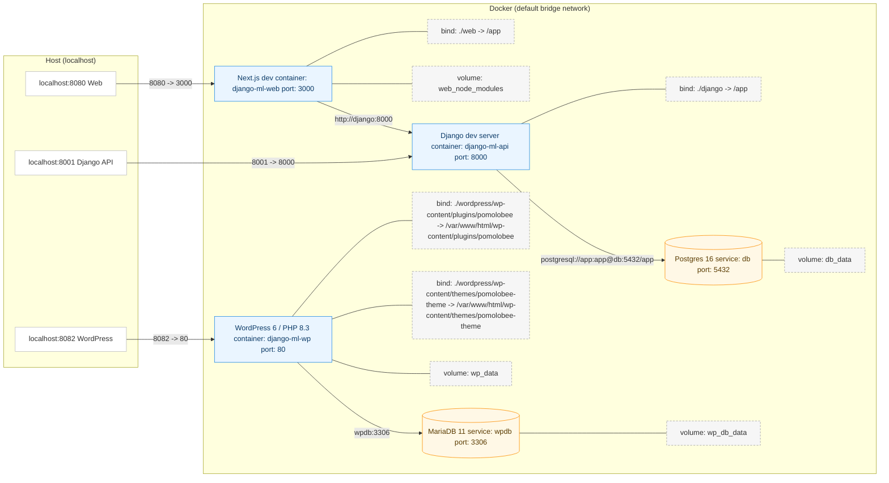

# django-ml : Dockerized PomoloBee (Django + Next.js + Postgres + WordPress + MariaDB)

A learning stack for Docker + multi-service development:

* **Django**: Django 5 backend (REST API, JWT auth; PomoloBee code inside)
* **Web**: Next.js 14 frontend (server routes call Django)
* **DB**: Postgres 16 (persistent volume)
* **WordPress**: `wordpress` service (Apache + PHP official image)
* **WP DB**: `wpdb` service (MariaDB 11)




---

## 🚀 Getting Started (fresh / after reset)

### 0) Prereqs

* Docker 24+, Docker Compose v2

**Wipe the stack (optional destructive reset):**

```bash
docker compose --profile dev down --rmi local --volumes --remove-orphans
```

### 1) Clone

```bash
git clone <your-repo-url>
cd django-ml
```

### 2) Create project-root `.env` (one file for everything)

```env
# Django
SECRET_KEY=dev-insecure                 # replace with a real key for anything public
DEBUG=1
ALLOWED_HOSTS=*
DATABASE_URL=postgresql://app:app@db:5432/app
BYPASS_MEDIA=1

# Next.js
BACKEND_INTERNAL_URL=http://django:8000
WEB_PORT=3000

# Postgres
POSTGRES_DB=app
POSTGRES_USER=app
POSTGRES_PASSWORD=app

# WordPress / MariaDB (optional: keep defaults or set explicitly)
WP_DB_NAME=wordpress
WP_DB_USER=wp
WP_DB_PASSWORD=wp
WP_DB_ROOT_PASSWORD=root
WP_TABLE_PREFIX=wp_
```

> Tip: generate a strong Django key in dev too:
> `openssl rand -base64 48 | tr -d '\n'` → paste as `SECRET_KEY=...`

### 3) Seed web dependencies (first run only)

```bash
docker compose --profile dev run --rm web npm ci
```

* You **do not** seed Django or WordPress deps manually; Django deps are baked into the image; WordPress/wpcli use official images.

### 4) Build & start everything

```bash
docker compose --profile dev up -d --build
```

* This starts **Postgres**, **Django** (which runs `python manage.py migrate && runserver`), **Next.js** (dev server), **MariaDB** (`wpdb`) and **WordPress** (after `wpdb` is healthy).
* Don’t run `runserver` or `npx next dev` manually—compose already does it.

### 5) Sanity checks
S
```bash
docker compose ps
curl -s http://localhost:8001/health      # Django -> {"status":"ok"}
curl -s http://localhost:8080/api/hello   # Web (proxies backend hello)
# WordPress UI: http://localhost:8082
```

### 6) Initialize Django data (first install of this DB)

**Use fixtures to populate the database :**

 

```bash
docker compose exec django python manage.py loaddata PomoloBeeCore/fixtures/initial_superuser.json
docker compose exec django python manage.py loaddata PomoloBeeCore/fixtures/initial_farms.json
docker compose exec django python manage.py loaddata PomoloBeeCore/fixtures/initial_fields.json
docker compose exec django python manage.py loaddata PomoloBeeCore/fixtures/initial_fruits.json
docker compose exec django python manage.py loaddata PomoloBeeCore/fixtures/initial_rows.json
```

**create a superuser interactively if you need to log**

```bash
docker compose exec django python manage.py createsuperuser
```
 

### 7) Finish WordPress installer (first run)

Open **[http://localhost:8082](http://localhost:8082)** and create a user to initialise the site 

 
### 8) Apply WordPress site options with wpcli  (permission, activate theme, permalinks, logo, etc.)


* Put your logo at `wordpress/wp-content/themes/pomolobee-theme/assets/images/logo.(png|svg)`

* run the init script :

```bash 
./scripts/wp-init.sh
``` 

The script will fix host bind-mount permissions and import the logo and set it as the site logo.


# 5) Wordpress Health check:

* log in http://localhost:8082 and check that the website is available

* run the checks :
```bash
./scripts/health-check.sh
``` 


### 9) Export Site Editor changes back into the theme (so they live in Git)

If you customize colors/templates in **Appearance → Editor**:

* Open the **⋯** (top-right) → **Tools → Export** and download the ZIP.
* Copy the ZIP contents (e.g. `theme.json`, `templates/`, `parts/`) into:

  ```
  wordpress/wp-content/themes/pomolobee-theme/
  ```
* Commit to Git.

---

## Useful commands

**Developpement only : Total reset image,data,container and reinstallation (danger)**

The following script delete all and reinstall docker completly in the dev environment
```bash
./scripts/total-reset.sh
```

this change wordpress repository to www-data:wwww-data
if you keep on developping there in order to make update for github, run at the root of the repository:
```bash
sudo setfacl -R -m u:"$USER":rwx wordpress
sudo setfacl -R -d -m u:"$USER":rwx wordpress
```
  

**Logs / status**

```bash
docker compose --profile dev ps -a
docker compose --profile dev logs -f django
docker compose --profile dev logs -f web
docker compose --profile dev logs -f wpdb
docker compose --profile dev logs -f wordpress
```

**Stop everything**

```bash
docker compose --profile dev down
```

**Clean DB only (danger)**

```bash
docker compose --profile dev down
docker volume rm django-ml_db_data
docker compose --profile dev up -d
```

**Clean WordPress only (danger)**

```bash
docker compose --profile dev stop wordpress wpdb
docker compose --profile dev rm -f wordpress wpdb
docker volume rm django-ml_wp_db_data django-ml_wp_data
docker compose --profile dev up -d wpdb wordpress
```

**backup database django and wordpress**
in root project
```bash
bash scripts/backup.sh
``` 

## wordpress plugins

**pomolobee**

From the wordpress/plugin-src/pomolobee/ folder:

```bash
npm install
npm run build
``` 
📦 Installation
```bash
build_zip.sh
install_plugin.sh
``` 
Go to **[http://localhost:8082](http://localhost:8082)** WP Admin > Plugins 
check the plugin is there and activate if necessary
Activate the plugin.
Visit Settings > Competence Settings to configure the API endpoint.
in our project docker example, the django dev container is http://localhost:8001/api 


---
## data structure


```text
django-ml/
├─ compose.yaml
├─ .env
├─ django/                      # Django project (config + apps)
│  ├─ manage.py
│  ├─ config/
│  └─ PomoloBeeCore/            # PomoloBee django app
│  └─ UserCore/                 # User Auth... app
├─ web/                         # Next.js app (dev server)
│  ├─ app/
│  └─ package.json
├─ wordpress/
│  └─ wp-content/
│     ├─ themes/
│     │  └─ pomolobee-theme/    # your theme (theme.json, templates, assets, scripts)
│     └─ plugins/
│        └─ pomolobee/          # (optional) your plugin
└─ (volumes managed by Docker)
   • db_data        (Postgres)
   • web_node_modules
   • wp_db_data     (MariaDB)
   • wp_data        (WordPress files)
```