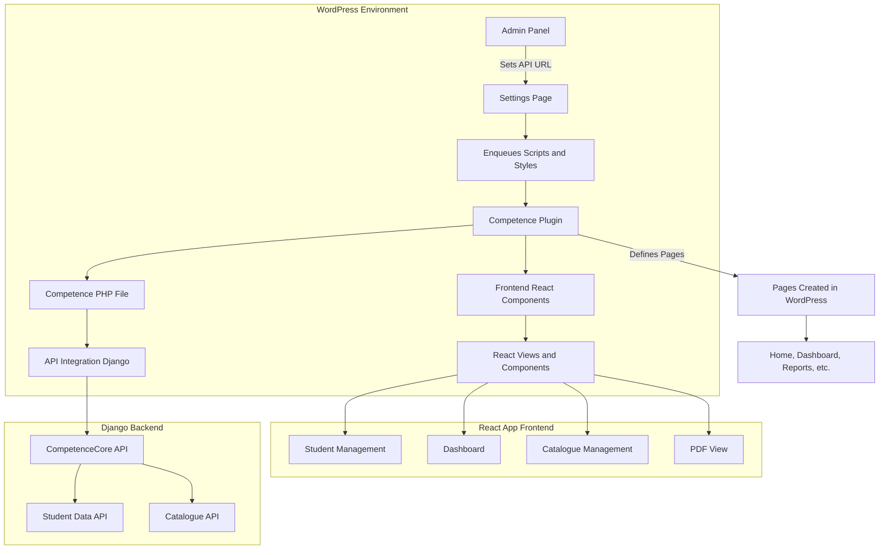

### **WordPress Plugin Structure (Competence WP)**

Here’s a detailed view of the **plugin structure** and the role each component plays in the plugin:

```text
wordpress/plugin-src/competence/
├── build                        # Contains compiled assets (built files)
├── build_zip.sh                 # Script to create ZIP file for WordPress
├── competence.php                # Main plugin PHP file
├── dist                         # Contains the built distribution files
├── install_plugin.sh            # Script to install the plugin in WordPress
├── node_modules                 # Node.js dependencies (created with npm install)
├── package.json                 # NPM configuration (dependencies)
├── package-lock.json            # NPM lock file
├── README.md                    # Documentation
├── src                          # Source code (React/Next.js)
├── tsconfig.json                # TypeScript configuration
├── webpack.config.js            # Webpack configuration for bundling
```

### **Plugin Code Structure**:

The plugin is built using **Next.js** and **React**, and all the frontend logic is contained within the **`src`** directory.

* **React Components**: Found in the `components/` directory, these include files like `StudentDisplay.tsx`, `Dashboard.tsx`, `StudentForm.tsx`, etc. These components are responsible for rendering the plugin’s interface in WordPress.

* **React Application**: The main application logic resides in `competence-app/` and includes:

  * `edit.tsx`, `render.php`, and other related files that define how each block should behave in the WordPress environment.

* **API Integration**: The plugin communicates with the Django backend via the `api.ts` file, using **AJAX requests** to fetch data (e.g., student data, test results).

### **Mermaid Diagram: Plugin Architecture Overview**

Here’s a **Mermaid diagram** to explain the different components/modules in the **Competence WP** plugin:



### **Key Points**:

1. **Plugin Registration**: The **PHP file** registers the plugin, creates pages in WordPress, and enqueues necessary styles/scripts.
2. **Page Creation**: On plugin activation, several pages like **Login**, **Home**, **Dashboard**, etc., are created with specific blocks for integration with React components.
3. **Admin Settings**: Through the **WordPress Admin Panel**, users can configure settings like the API URL for the Django backend.
4. **Frontend Integration**: The **React components** are used to render dynamic content in the WordPress pages. The React app communicates with the Django backend via AJAX requests to fetch and display data.

---

### **Plugin Workflow Summary**

1. **PHP Role**:

   * Registers the plugin and sets up WordPress pages.
   * Loads external styles and scripts.
   * Handles admin settings (API URL configuration).
   * Passes settings (like API URL) to the frontend React application.

2. **React Role**:

   * Handles the frontend display and user interaction.
   * Communicates with the Django backend via API requests.
   * Dynamically loads content like student data, reports, etc.

---
